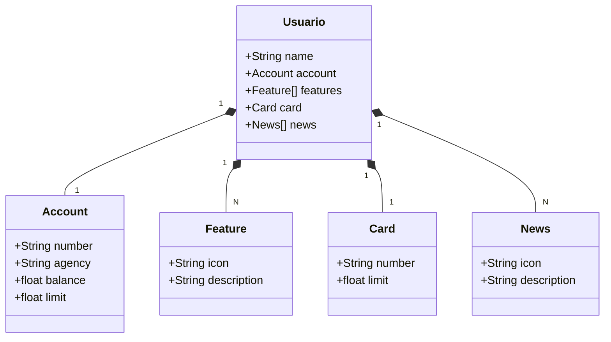

# API-Restfull bootcamp Santander - dio

## Diagrama de classes

```mermaid
classDiagram
    class Usuario {
        +String name
        +Account account
        +Feature[] features
        +Card card
        +News[] news
    }

    class Account {
        +String number
        +String agency
        +float balance
        +float limit
    }

    class Feature {
        +String icon
        +String description
    }

    class Card {
        +String number
        +float limit
    }

    class News {
        +String icon
        +String description
    }

    Usuario "1" *-- "1" Account
    Usuario "1" *-- "N" Feature
    Usuario "1" *-- "1" Card
    Usuario "1" *-- "N" News
```
